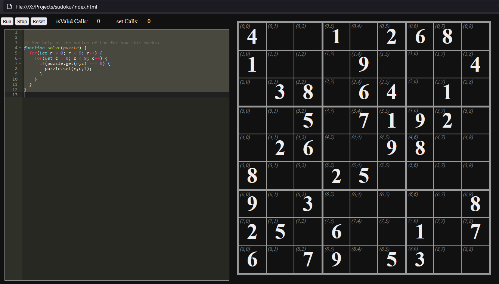

# sudoku-exercise

Simple playground for creating and testing algorithms for solving Sudoku puzzles.

## Usage

[Try it yourself](https://marwatk.github.io/sudoku-exercise).
Or download the source and open [index.html](./index.html) in your browser.

See the _Help_ button at the top of the page for how to write a solver.
